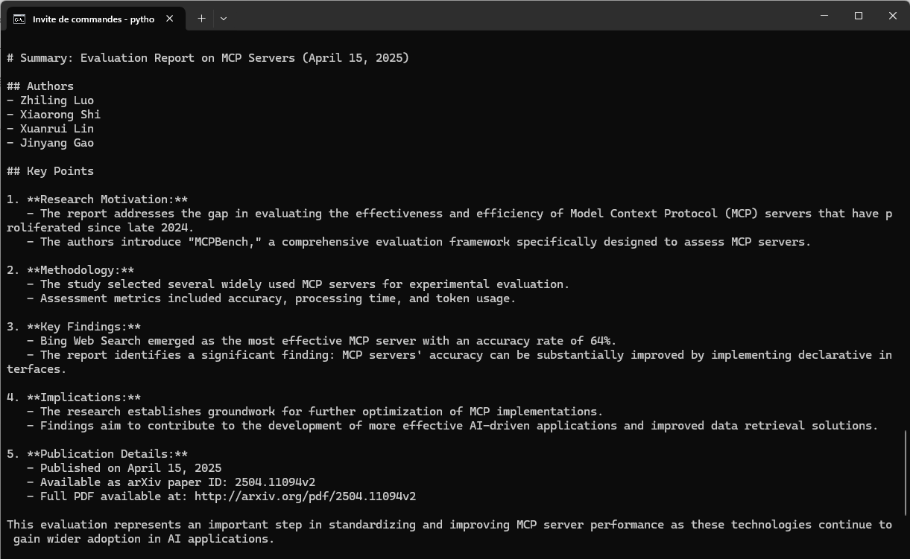

# MCP ChatBot - Live Demo

This document showcases the MCP ChatBot in action with real screenshots demonstrating the complete workflow.

## Demo Screenshots

Here's the MCP ChatBot in action, demonstrating the complete workflow from setup to research results:

### 1. Initial Server Connection

*Setting up the virtual environment and installing required dependencies*

### 3. First Research Query

*First question on searching papers on arXiv*

### 2. Environment Setup and Installation

*First answer about the first query*

### 4. Second Research Query

*Second question for a summary of the paper*

### 5. Research Results

*Answer of the question 2*

## Key Features Demonstrated

- ✅ **Automatic MCP Server Discovery**: The system automatically connects to research servers
- ✅ **Tool Integration**: Claude seamlessly uses arXiv search tools when needed
- ✅ **Interactive Conversations**: Natural language queries for academic research
- ✅ **Structured Results**: Well-formatted paper information with titles, authors, and summaries
- ✅ **Error Handling**: Graceful handling of connection issues and API limits

## Typical Workflow

1. **Setup** → Activate virtual environment and install dependencies
2. **Launch** → Start the chatbot (automatically connects to MCP servers)
3. **Query** → Ask research questions in natural language
4. **Processing** → Claude analyzes and determines if arXiv tools are needed
5. **Results** → Receive formatted academic paper information

The MCP architecture makes it easy to extend with additional research tools and databases!