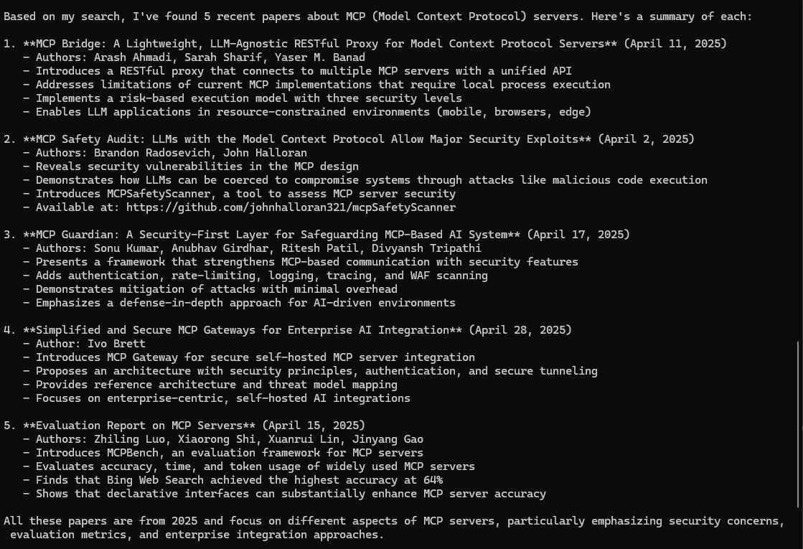
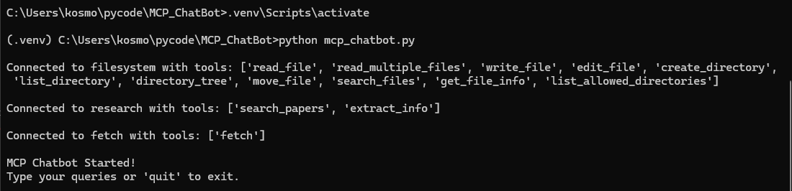
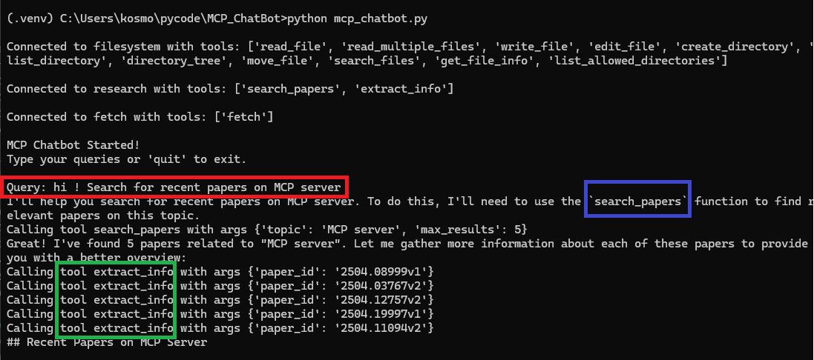
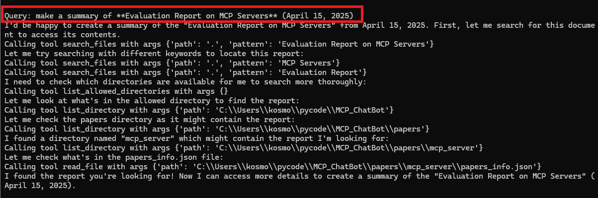
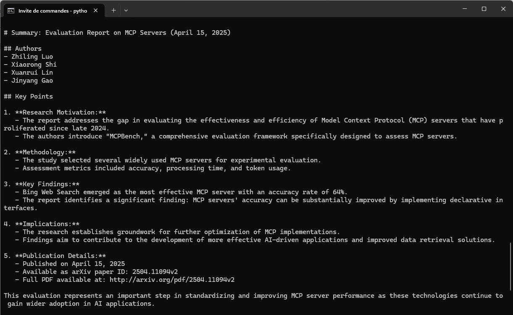

# MCP ChatBot - arXiv Research Project

An intelligent chatbot using the MCP (Model Context Protocol) to search and analyze scientific papers on arXiv via Claude.

## Project Architecture

### File Structure

```
MCP_ChatBot/
├── .venv/                 # Python virtual environment
├── papers/                # Papers storage directory
├── mcp_chatbot.py        # Main MCP client
├── research_server.py    # MCP server for arXiv tools
└── server_config.json    # MCP servers configuration
```

## Main Components

### 1. `research_server.py` - MCP Server
Server that exposes arXiv research tools via the MCP protocol:

- **`search_papers()`** : Search papers by topic on arXiv
- **`extract_info()`** : Extract details of a specific paper
- Uses `@mcp.tool()` decorator for automatic schema generation
- Local storage of results in JSON organized by topic

### 2. `mcp_chatbot.py` - MCP Client
Asynchronous client that orchestrates communication between Claude and MCP servers:

- **Multi-server connection** : Dynamically connects to configured MCP servers
- **Tool discovery** : Automatically retrieves the list of available tools
- **Session management** : Maintains active connections with automatic cleanup
- **Conversational interface** : Interactive chat loop with Claude

### 3. `server_config.json` - Configuration
JSON configuration file defining MCP servers to connect:

```json
{
  "mcpServers": {
    "research": {
      "command": "python",
      "args": ["research_server.py"]
    }
  }
}
```

## How It Works

### Data Flow
1. **Initialization** : Client reads configuration and connects to MCP servers
2. **Discovery** : Each server exposes its available tools
3. **Conversation** : User asks a question to Claude
4. **Decision** : Claude analyzes and decides to use arXiv tools if necessary
5. **Execution** : Client routes the call to the appropriate MCP server
6. **Response** : Results are returned to Claude for final response formulation

### MCP Architecture Benefits
- **Modularity** : Independent and reusable servers
- **Scalability** : Easy addition of new servers/tools
- **Separation of concerns** : Client (conversation) vs Server (business tools)
- **Auto-documentation** : Schemas automatically generated from code

## Installation and Execution

### Prerequisites
- Python 3.8+
- Anthropic API Key

### Environment Setup

```bash
# 1. Create project directory
mkdir MCP_ChatBot
cd MCP_ChatBot

# 2. Create virtual environment
python -m venv .venv

# 3. Activate virtual environment
# Windows:
.venv\Scripts\activate
# Mac/Linux:
source .venv/bin/activate

# 4. Install dependencies
pip install anthropic python-dotenv mcp arxiv

# 5. Create .env file with your API key
echo "ANTHROPIC_API_KEY=your_key_here" > .env
```

### Running the ChatBot

```bash
# Ensure virtual environment is activated
.venv\Scripts\activate  # Windows
# source .venv/bin/activate  # Mac/Linux

# Launch the chatbot (automatically starts MCP servers)
python mcp_chatbot.py
```

The `research_server.py` server is automatically launched by the MCP client according to configuration. No need to start it manually.

### Usage

Once running, ask questions like:
- "Find me articles on artificial intelligence"
- "Search for recent papers on neural networks"
- "Give me details of the paper with ID 2301.xxxxx"

The chatbot will automatically use arXiv tools to respond contextually and accurately.

## Demo Screenshots

Here's the MCP ChatBot in action, demonstrating the complete workflow from setup to research results:

### 1. Environment Setup and Installation

*Setting up the virtual environment and installing required dependencies*

### 2. Initial Server Connection

*MCP servers connecting and tool discovery process*

### 3. First Research Query

*User asking for research on artificial intelligence topics*

### 4. Second Research Query

*Another research request demonstrating the interactive capabilities*

### 5. Research Results

*Claude providing formatted research results with paper details from arXiv*

### Key Features Demonstrated

- ✅ **Automatic MCP Server Discovery**: The system automatically connects to research servers
- ✅ **Tool Integration**: Claude seamlessly uses arXiv search tools when needed
- ✅ **Interactive Conversations**: Natural language queries for academic research
- ✅ **Structured Results**: Well-formatted paper information with titles, authors, and summaries
- ✅ **Error Handling**: Graceful handling of connection issues and API limits

### Typical Workflow

1. **Setup** → Activate virtual environment and install dependencies
2. **Launch** → Start the chatbot (automatically connects to MCP servers)
3. **Query** → Ask research questions in natural language
4. **Processing** → Claude analyzes and determines if arXiv tools are needed
5. **Results** → Receive formatted academic paper information

The MCP architecture makes it easy to extend with additional research tools and databases!